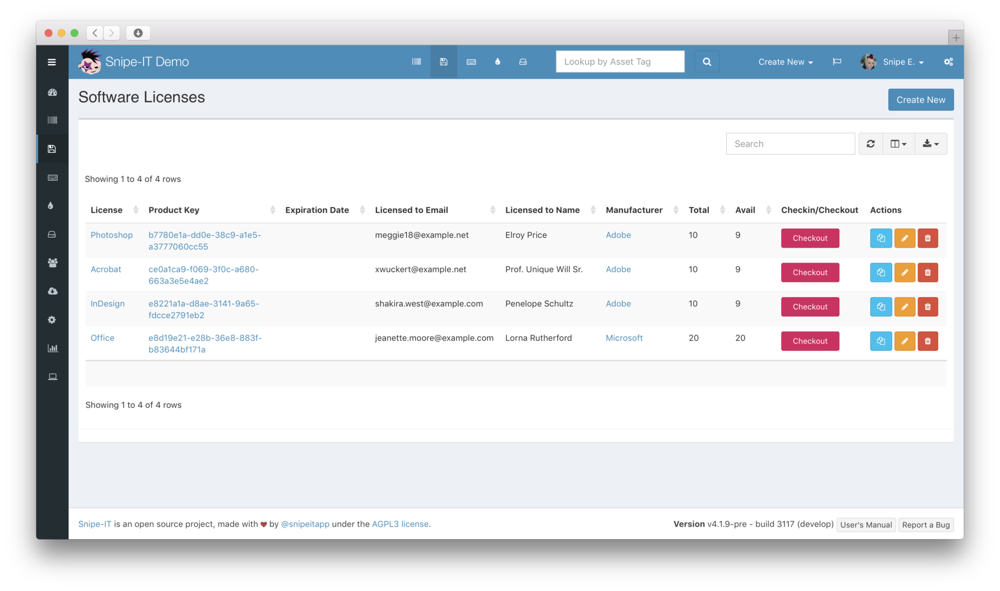

<!--
N.B.: This README was automatically generated by https://github.com/YunoHost/apps/tree/master/tools/README-generator
It shall NOT be edited by hand.
-->

# Snipe-IT pour YunoHost

[](https://dash.yunohost.org/appci/app/snipeit)  

[](https://install-app.yunohost.org/?app=snipeit)

*[Read this readme in english.](./README.md)*

> *Ce package vous permet d’installer Snipe-IT rapidement et simplement sur un serveur YunoHost.
Si vous n’avez pas YunoHost, regardez [ici](https://yunohost.org/#/install) pour savoir comment l’installer et en profiter.*

## Vue d’ensemble

This is a FOSS project for asset management in IT Operations. Knowing who has which laptop, when it was purchased in order to depreciate it correctly, handling software licenses, etc.

**Version incluse :** 6.1.0~ynh1

**Démo :** https://snipeitapp.com/demo/

## Captures d’écran



## Documentations et ressources

* Site officiel de l’app : <https://snipeitapp.com>
* Documentation officielle utilisateur : <https://snipe-it.readme.io/docs/overview>
* Documentation officielle de l’admin : <https://snipe-it.readme.io/docs/introduction>
* Dépôt de code officiel de l’app : <https://github.com/snipe/snipe-it>
* Signaler un bug : <https://github.com/YunoHost-Apps/snipeit_ynh/issues>

## Informations pour les développeurs

Merci de faire vos pull request sur la [branche testing](https://github.com/YunoHost-Apps/snipeit_ynh/tree/testing).

Pour essayer la branche testing, procédez comme suit.

``` bash
sudo yunohost app install https://github.com/YunoHost-Apps/snipeit_ynh/tree/testing --debug
ou
sudo yunohost app upgrade snipeit -u https://github.com/YunoHost-Apps/snipeit_ynh/tree/testing --debug
```

**Plus d’infos sur le packaging d’applications :** <https://yunohost.org/packaging_apps>