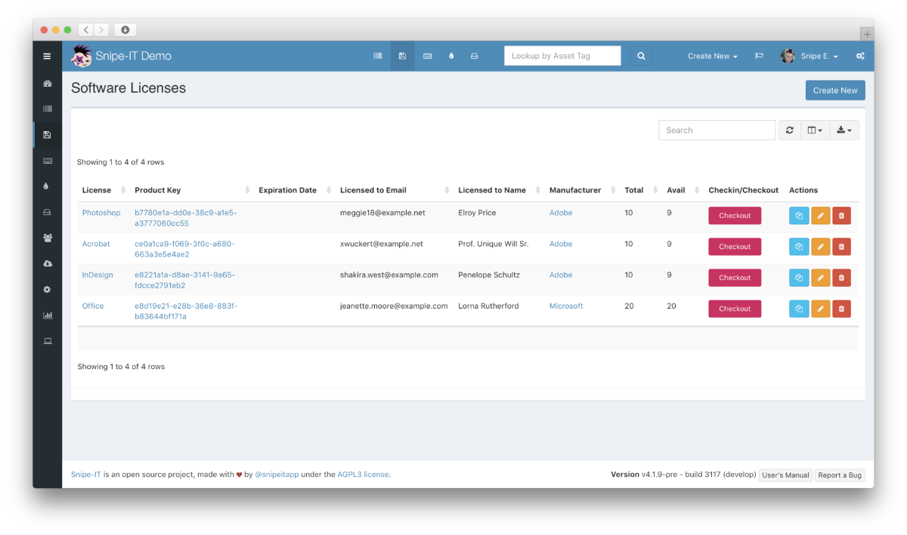

<!--
NOTA: Este README foi creado automáticamente por <https://github.com/YunoHost/apps/tree/master/tools/readme_generator>
NON debe editarse manualmente.
-->

# Snipe-IT para YunoHost

[](https://dash.yunohost.org/appci/app/snipeit)  

[](https://install-app.yunohost.org/?app=snipeit)

*[Le este README en outros idiomas.](./ALL_README.md)*

> *Este paquete permíteche instalar Snipe-IT de xeito rápido e doado nun servidor YunoHost.*  
> *Se non usas YunoHost, le a [documentación](https://yunohost.org/install) para saber como instalalo.*

## Vista xeral

Snipeit is a FOSS project for asset management in IT Operations. Knowing who has which laptop, when it was purchased in order to depreciate it correctly, handling software licenses, etc.

**Versión proporcionada:** 6.3.4~ynh1

**Demo:** <https://snipeitapp.com/demo/>

## Capturas de pantalla



## Documentación e recursos

- Web oficial da app: <https://snipeitapp.com>
- Documentación oficial para usuarias: <https://snipe-it.readme.io/docs/overview>
- Documentación oficial para admin: <https://snipe-it.readme.io/docs/introduction>
- Repositorio de orixe do código: <https://github.com/snipe/snipe-it>
- Tenda YunoHost: <https://apps.yunohost.org/app/snipeit>
- Informar dun problema: <https://github.com/YunoHost-Apps/snipeit_ynh/issues>

## Info de desenvolvemento

Envía a túa colaboración á [rama `testing`](https://github.com/YunoHost-Apps/snipeit_ynh/tree/testing).

Para probar a rama `testing`, procede deste xeito:

```bash
sudo yunohost app install https://github.com/YunoHost-Apps/snipeit_ynh/tree/testing --debug
ou
sudo yunohost app upgrade snipeit -u https://github.com/YunoHost-Apps/snipeit_ynh/tree/testing --debug
```

**Máis info sobre o empaquetado da app:** <https://yunohost.org/packaging_apps>
