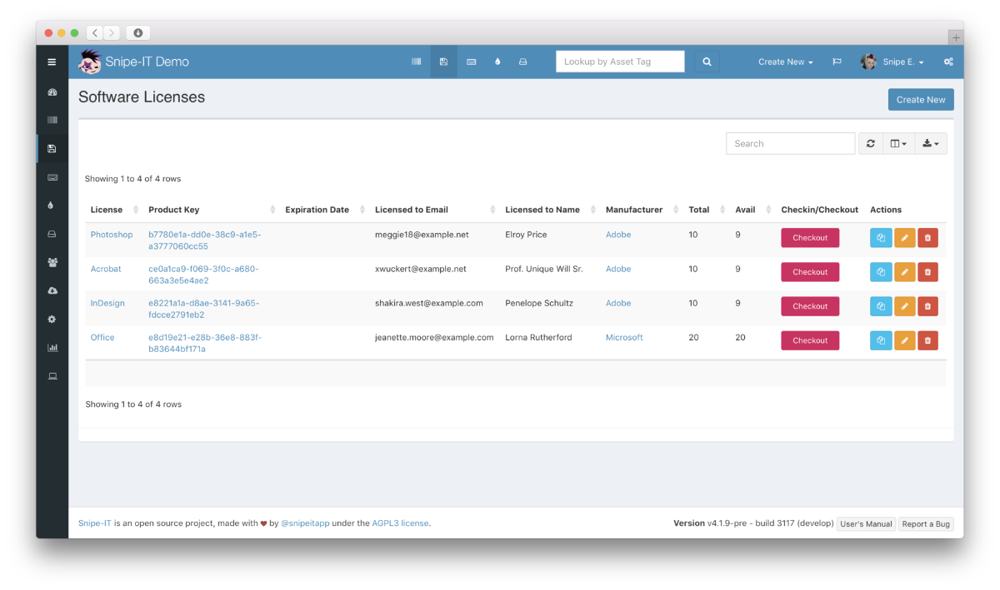

<!--
To README zostało automatycznie wygenerowane przez <https://github.com/YunoHost/apps/tree/master/tools/readme_generator>
Nie powinno być ono edytowane ręcznie.
-->

# Snipe-IT dla YunoHost

[](https://ci-apps.yunohost.org/ci/apps/snipeit/)


[](https://install-app.yunohost.org/?app=snipeit)

*[Przeczytaj plik README w innym języku.](./ALL_README.md)*

> *Ta aplikacja pozwala na szybką i prostą instalację Snipe-IT na serwerze YunoHost.*  
> *Jeżeli nie masz YunoHost zapoznaj się z [poradnikiem](https://yunohost.org/install) instalacji.*

## Przegląd

Snipeit is a FOSS project for asset management in IT Operations. Knowing who has which laptop, when it was purchased in order to depreciate it correctly, handling software licenses, etc.

**Dostarczona wersja:** 7.1.15~ynh1

**Demo:** <https://snipeitapp.com/demo/>

## Zrzuty ekranu



## Dokumentacja i zasoby

- Oficjalna strona aplikacji: <https://snipeitapp.com>
- Oficjalna dokumentacja: <https://snipe-it.readme.io/docs/overview>
- Oficjalna dokumentacja dla administratora: <https://snipe-it.readme.io/docs/introduction>
- Repozytorium z kodem źródłowym: <https://github.com/snipe/snipe-it>
- Sklep YunoHost: <https://apps.yunohost.org/app/snipeit>
- Zgłaszanie błędów: <https://github.com/YunoHost-Apps/snipeit_ynh/issues>

## Informacje od twórców

Wyślij swój pull request do [gałęzi `testing`](https://github.com/YunoHost-Apps/snipeit_ynh/tree/testing).

Aby wypróbować gałąź `testing` postępuj zgodnie z instrukcjami:

```bash
sudo yunohost app install https://github.com/YunoHost-Apps/snipeit_ynh/tree/testing --debug
lub
sudo yunohost app upgrade snipeit -u https://github.com/YunoHost-Apps/snipeit_ynh/tree/testing --debug
```

**Więcej informacji o tworzeniu paczek aplikacji:** <https://yunohost.org/packaging_apps>
